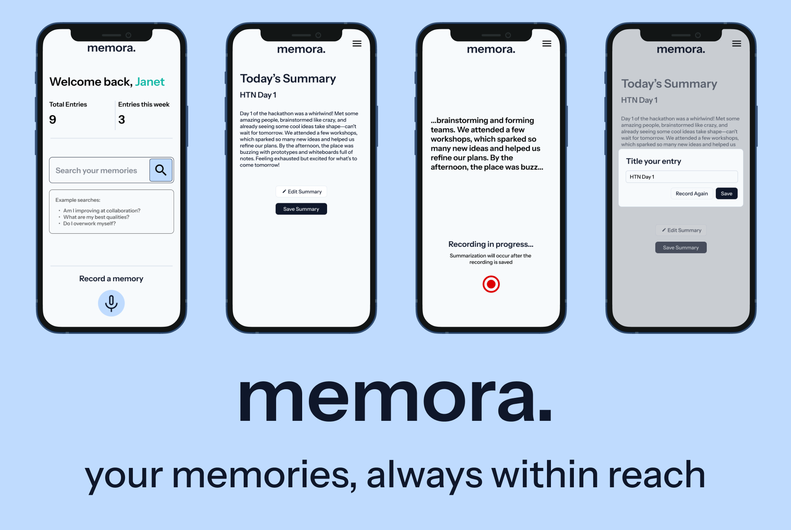

# memora

memora is a journaling app that knows you better than yourself. It works as a voice diary, allowing you to record spoken diary entries. memora summarizes and analyzes these entries to understand your personality, traits, and values. With this info, you can ask memora any question such as "do I overwork myself?" or "Am I improving at collaboration?" and it can give you thorough answers based on your entries, allowing you to more deeply understand yourself. 

## the inspiration.
My phone contains over 2GB of voice memos, featuring countless moments of meaningful introspection, happy moments, and forgotten stories, but none of them are ever replayed once they've been recorded. In the search of figuring out a more efficient and helpful way for people to record and store voice diaries, the team realized that data could be used rather than just stored. From that thought, they came up with memora, which summarizes recordings to make them easy to look back at, while also helping people understand themselves on a deeper level. 

## what's next for memora.
lots :)